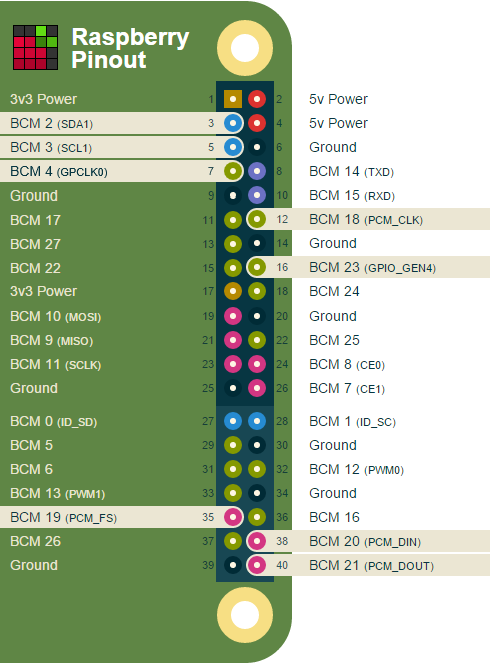

## How to use Jacksense application

Before using Jacksense app on **Raspberry Pi** (or **RPi**), the following things we have to check first:


- Check if Solana driver supports jack detection
- Connect RPi GPIO (BCM 25) to EVK's JP22-pin2
- Copy pre-built excutable application (cxjacksense) and routing path scripts to RPi
- Modify sound card device and input event based on the system enviroment

### Check if Solana driver supports jack detection
We are using one GPIO on RPi for the lineout jack detection. Application will query current jack status through mixer command.

We can check if driver can report jack status by using the command:

```
$ amixer -c0 cget iface=CARD,name='Headphones Jack'
```

Note: option -cn 'n' means the sound card number

If you see the card control content, it means the codec driver support the jack sense detection.

### Connect RPi GPIO (BCM 25) to EVK's JP22-pin2
Below is 40-pin RPi diagram:




Since GPIO pin is used for jack detection, we have to connect JP22-pin2 on round EVK to GPIO 25 on RPi.
Once it is done, you can test the jack detection status by using command:

```
$ amixer -c0 cget iface=CARD,name='Headphones Jack'
```

It can display **'values=on'** when headphone is plugged in and **'values=off'** when headphone is unplugged.

### Copy pre-built excutable application (cxjacksense) and routing path scripts to RPi

There are 3 shell scripts and 1 excutatble file in the package.

- run_jacksense.sh : check current jack status at first and run jacksense monitor
- cx-jack-speaker.sh : routing for class-d
- cx-jack-headphone.sh : routing for lineout/headphone
- cxjacksense : a light application for monitoring jack status

Please copy all files to the path "/usr/local/bin"
and make them excutable by using the command :

```
$ chmod +x * ; sudo cp * /usr/local/bin
```

### Modify sound card device and input event based on the system enviroment

In the scripts, we assume you are using Conexant sound card with card number **'0'** and GPIO input event handler **'event2'**.

How to check the card number?
Using the following command:

```
$ aplay -l
```

You will find the card number with card name **'cxsmartspeaker'**

How to check GPIO input event handler?
Using the following command:

```
$ cat /proc/bus/input/devices
```

You will find the input device handler with the name **"cx-smart-speaker Headphones"**

If you found the card numer is not 0 or GPIO input event handler is not event2.

Please modify the shell scripts **"run_jacksense.sh"**, **"cx-jack-speaker.sh"** and **"cx-jack-headphone.sh"** with correct number/name based on your system.

### Run the jacksense app


When everything is done, please try the command below to start the jack sense detection app.

```
$ run_jacksense.sh
```

Then you also can test to plug in/unplug the headphone when playing music. The application will route to correct path based on jack detection.


Finally, if everything works fine ,please run this script whenever the system startup.

e.g:

We can add the following command in the **/etc/rc.local** file for executing **run_jacksense.sh** when system startup:

```bash
.....
.....
##Run jacksense app when startup##
run_jacksense.sh

exit 0
```

